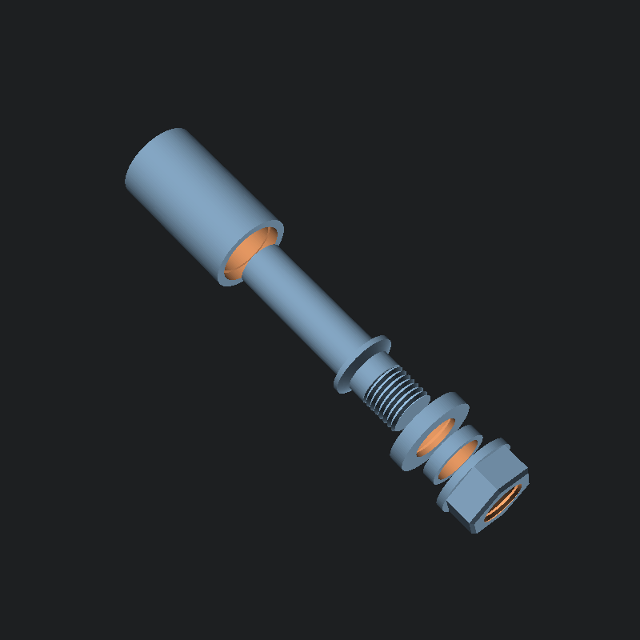

# filament-roller
smooth rolling spool holder. sized for Ender3 V2.

## bill of materials

- 2x 6806 bearings _not included_ (30mm bore ID, 42mm OD, 7mm thickness, 6mm sidewall)
- ~110g PLA+ ~(10h 15min)
  - **roller** (51g, 4h 44min)
  - **arm** (29g, 2h 38min)
  - **washer** (9g, 49min)
  - **spacer** (4g 22min)
  - **flange nut** (16g, 1h 32min)

## printing

- as tested:
  - 0.3mm layer heights and 0.35 layer width from a 0.4mm nozzle
  - slower print speed for threaded items (arm & nut)
  - wall line count of 4
  - 15% gyroid infill
  - concentric top and bottom layers
- **roller** requires supports under lower internal inset (support angle 75°)
- **arm** benefits from a brim for better adhesion and stability
- **flange nut** threads have fewer failures with _Wall Ordering: Inside to Outside_

## automated rendering via OpenSCAD command line

windows (assumes `openscad.com` is on the path)
- `assemby.bat` - renders assembly image
- `parts.bat` - generates STL files for all parts
